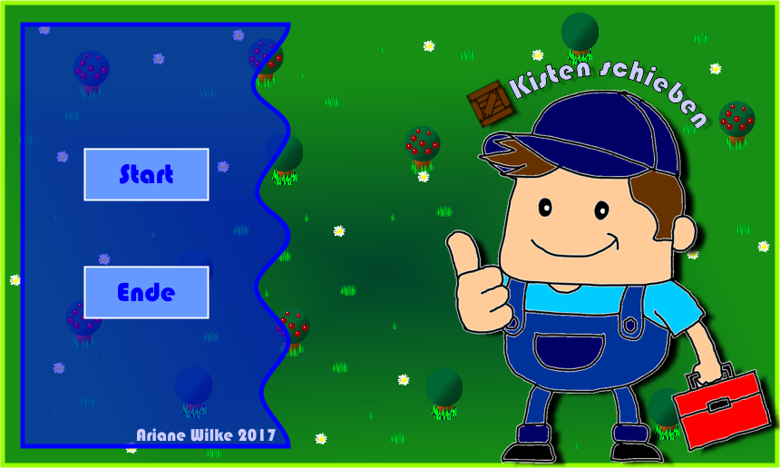
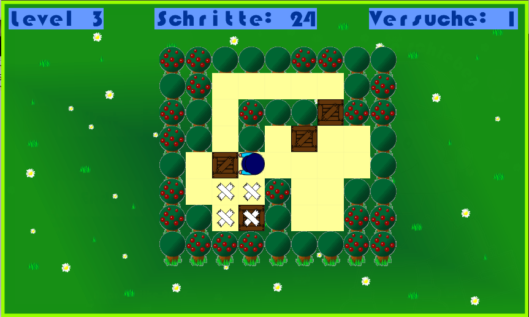

# Kisten Schieben

**von Ariane Wilke**

## Kurzbeschreibung

Das Spielprinzip von **"Kisten Schieben"** orientiert sich am Klassiker [Sokoban](https://en.wikipedia.org/wiki/Sokoban). In jedem Level werden unterschiedlich viele Holzkisten auf eine entsprechende Markierung geschoben. Sobald das erledigt ist, hat der Spieler das Level gewonnen und kann mit dem nächsten fortfahren.

Die Figur lässt sich mit den Pfeiltasten bewegen. Falls eine Kiste gegen die Wand geschoben wird, kann das Level mithilfe der Leertaste auf den Ausgangspunkt zurückgesetzt werden.

## Screenshots

## Das Programm

[Quelltext als Zip-Datei](../releases/kisten_schieben_AWilke_201704.zip)

[Ausführbares Programm (Windows)](../executables/Kistenspiel_ArianeWilke_201704.exe)

## Installationshinweise

Das Spiel verwendet die Bibliotheken **SDL2** und **SDL2-Image**.

Unter Windows werden folgende DLLs benötigt:

* libjpeg-9.dll
* libtiff-5.dll
* libpng16-16.dll
* libwebp-4.dll
* SDL2.dll
* SDL2_image.dll
* zlib1.dll

## Kontakt

[a.wilke04@t-online.de](mailto:a.wilke04@t-online.de)

## Lizenzbedingungen

Zum Zeichnen des Klempners diente eine [lizenzfreie Vektorgrafik](https://de.123rf.com/photo_50297931_klempner-die-daumen-nach-oben.html) als Vorlage.
