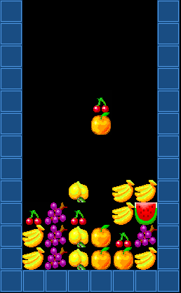
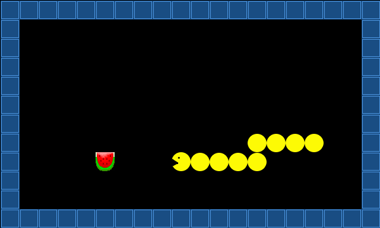
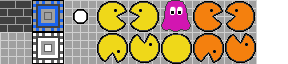

# Projektskizze

## Ziel

* Das Abschlußprojekt vorbereiten
* Ein großes Projekt in kleinere Schritte zerlegen

## Arbeitsschritte

1. Sichte das Bildmaterial weiter unten

2. Finde Dich mit 1-3 anderen Leuten zu einem Team zusammen

3. Diskutiert mögliche Ideen für ein Projekt (es ist völlig in Ordnung, eines der Spiele aus den Bildern nachzubauen)

4. Formuliert eine Kurzbeschreibung Eures Projekts in 2-3 Sätzen

5. Sammelt in Stichpunkten mögliche Features für das Spiel

Schickt eine Projektskizze an `krother@academis.eu`, die folgendes enthält:

* Name + email der Teammitglieder
* Kurzbeschreibung des Spiels
* die Liste geplanter Features

Kristian wird Euch ein kurzes Feedback zur Idee und seine Einschätzung der Schwierigkeit schicken.

## Anmerkung

* Die Abgabe als Team ist möglich.
* Es ist auch möglich, mehrere Versionen des gleichen Projekts abzugeben, 
falls sich Eure Ideen auf dem Weg in unterschiedliche Richtungen entwickeln. 
* Bitte maximal 4 Personen pro Team.
* Die Features dienen Euch als Arbeitsgrundlage und dürfen sich auch mittendrin ändern.
* Hauptsache das Spiel (und das Programmieren desselben) machen Spaß.

## Bildergalerie

Spielszenen von Kristian

Einige Grafikelemente

Aus **Bub n Bros**

