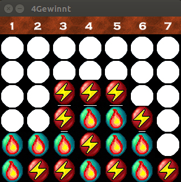

# Vier Gewinnt

**von Natalia Neumeister und Nikola Nikolov**

## Kurzbeschreibung

Vier gewinnt ist ein Zweipersonen-Strategiespiel. Es wird auf einem Spielbrett gespielt, in das die Spieler abwechselnd ihre Spielsteine Spielstein Feuer oder Blitz fallen lassen. Das Spielbrett besteht aus sieben Spalten (senkrecht) und sechs Reihen (waagerecht). Jeder Spieler besitzt 21 gleichfarbige Spielsteine. Wenn ein Spieler einen Spielstein in eine Spalte fallen lässt, besetzt dieser den untersten freien Platz der Spalte.

Gewinner ist der Spieler, der es als erster schafft, vier oder mehr seiner Spielsteine waagerecht, senkrecht oder diagonal in eine Linie zu bringen. Das Spiel endet unentschieden, wenn das Spielbrett komplett gefüllt ist, ohne dass ein Spieler eine Viererlinie gebildet hat.

## Screenshot

## Das Programm

[Quelltext als Zip-Datei](../releases/vier_gewinnt_NNikolov_NNeumeister_201704.zip)

## Installationshinweise

Das Spiel verwendet die Bibliotheken **SDL2** und **SDL2-Image**.

Unter Windows werden folgende DLLs benötigt:

* libjpeg-9.dll
* libtiff-5.dll
* libpng16-16.dll
* libwebp-4.dll
* SDL2.dll
* SDL2_image.dll
* zlib1.dll

## Kontakt

Nikola: [nik.nikolov93@gmail.com](mailto:nik.nikolov93@gmail.com)

Natalja: [nati.neu@bluewin.ch](mailto:nati.neu@bluewin.ch)

## Lizenzbedingungen

Die Feuerkugeln und Blitze wurden auf der Grundlage der Grafiken von [Bub'n'Bros](http://bub-n-bros.sourceforge.net/) von David Gowers und McSebi entwickelt.
