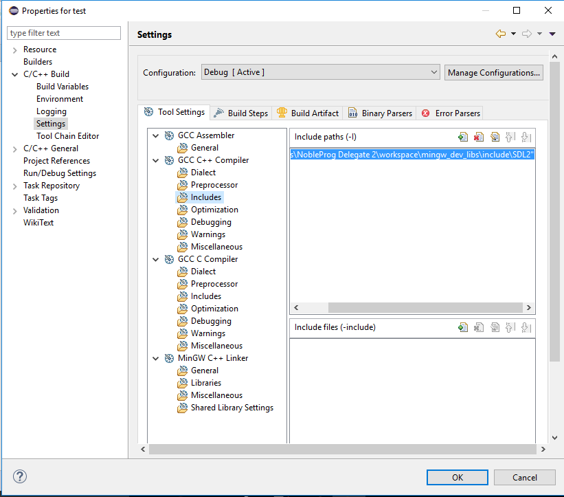
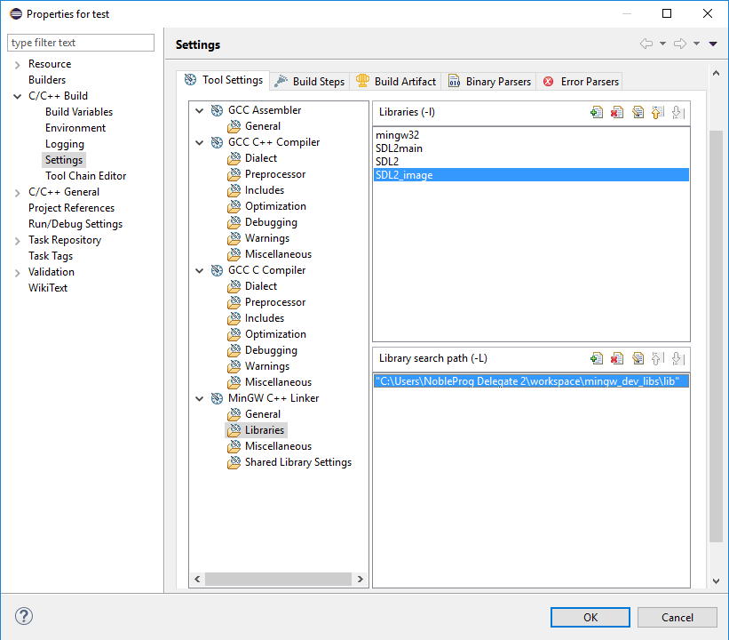
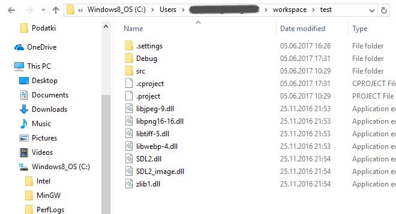
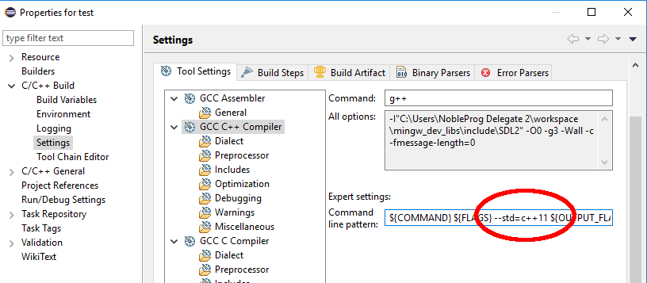

# SDL-Programme unter Eclipse compilieren

Um die Bibliothek SDL in einem Eclipse-Projekt zu verwenden, muß ziemlich viel in Eclipse konfiguriert werden. Versuche Dich, möglichst präzise an die folgende Anleitung zu halten. Wenn es nicht funktioniert, zögere bitte nicht, eine Mail mit Fehlerbeschreibung (am Besten mit Screenshot) an `krother@academis.eu` zu schreiben.

Führe die folgenden Schritte durch:

### 1. Starte Eclipse

Im Startmenü (sofern Du Eclipse schon installiert hast).

### 2. Lege ein neues MinGW-C++ Projekt an

Unter `New` -> `C++ Project`

### 3. Erstelle eine neue C++-Datei

Erstelle im Projekt ein **C++ Source File** und speichere es in einer Datei mit der Endung `.cpp`

Füge folgenden C++-Code in die Datei ein:

    #include <SDL.h>
    #include <SDL_image.h>

    int main(int a, char **b) {
        SDL_Init(SDL_INIT_VIDEO);
        SDL_Window *win = SDL_CreateWindow("Hello World!", 100, 100, 300, 300, SDL_WINDOW_SHOWN);
        SDL_Delay(2000);
        return 0;
    }

#### Überprüfung:

Speichere den Quelltext ab und versuche, die Datei zu compilieren. **Du solltest eine Fehlermeldung erhalten, die in etwa folgenden Inhalt hat:**

    SDL.h not found

### 4. Kopiere die SDL-Bibliotheken

Lade die Bibliotheken SDL2 und SDL2image herunter. 

**TODO: Link zu `mingw_dev_libs/` einsetzen**

Kopiere den Ordner in den Ordner `workspace/` in Deinem Benutzerverzeichnis. 

#### ACHTUNG:

Kopiere die SDL-Bibliotheken **auf keinen Fall** in Dein Projektverzeichnis. Das bringt Eclipse nur durcheinander, und Du bekommst komische Fehlermeldungen.

### 5. Setze den Include-Pfad

Wir müssen Eclipse sagen, wo die Header-Dateien der SDL-Bibliothek zu finden sind.

Suche dazu im Projectmenü (Rechtsklick auf das Projekt) den Menüpunkt `Properties` (ganz unten).

Finde den Dialog `Project -> Properties -> C++ Build -> Settings -> C++ Compiler`

Füge im Eingabefeld **Includes** das Verzeichnis `workspace/mingw_dev_libs/includes/SDL2` hinzu (je nachdem wo dieses auf dem Rechner liegt). 

#### Überprüfung:

Versuche das Programm erneut zu compilieren. Wenn Du nun eine andere Fehlermeldung als zuvor erhälst, hat es funktioniert.

### 6. Sage Eclipse, wo die Bibliotheken selbst zu finden sind

Zusätzlich zu den Header-Dateien benötigen wir die Libraries.

Füge dazu im Dialog `Project -> Properties -> C++ Build -> Settings -> MinGW C++ Linker` 
zu **Libraries** die folgenden 4 Einträge hinzu:
    
* mingw32
* SDL2main
* SDL2
* SDL2_image

Füge außerdem zu **Library Search path** (direkt darunter) das Verzeichnis `workspace/mingw_dev_libs/lib/` hinzu
(je nachdem wo dieses auf dem Rechner liegt).

#### Überprüfung:

Versuche das Programm erneut zu compilieren. Wenn Du nun gar keine Fehlermeldung mehr erhälst, hast Du es richtig gemacht. Das Programm ist aber noch nicht ausführbar.

### 7. Kopiere die DLLs

Zum Ausführen des fertigen Programms sind die DLL-Dateien notwendig. Kopiere die 
 in Dein Projektverzeichnis. Es sollten dort insgesamt 7 DLL-Dateien sein.

Jetzt sollte das Beispielprogramm starten und ein leeres Fenster erscheinen.

#### Erste Hilfe

Wenn DLLs fehlen, erkennst Du das daran, dass das SDL-Beispielprogramm gleich wieder beendet wird, ohne dass ein Fenster erscheint.

### 8. Bilder kopieren

Wenn Dein Programm eigene Bilddateien benötigt, mußt Du auch diese ins Projektverzeichnis kopieren (dorthin, wo auch die DLLs liegen, es sei denn, Dein Programm sucht sie in einem Unterverzeichnis).

### 9. C++-Standard einstellen

Um auf einige fortgeschrittene Features von C++ zuzugreifen (Smart Pointer, Vektoren, Templates usw.), mußt Du den C++-Standard auf C++11 oder C++14 festlegen. Füge dazu zu den Compilereinstellungen den Text

    --std=c++11

hinzu (mit Leerzeichen davor und dahinter).

Das war es dann aber auch endlich!

