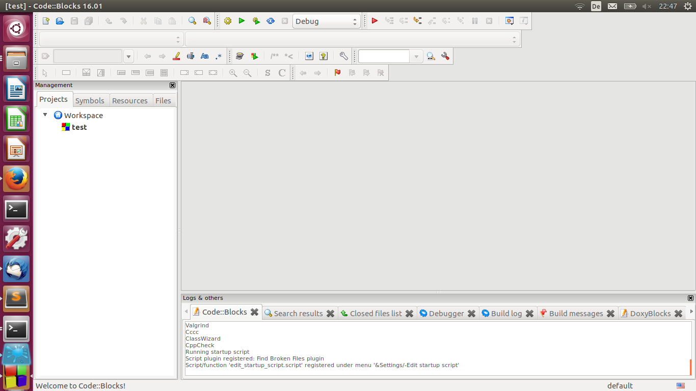
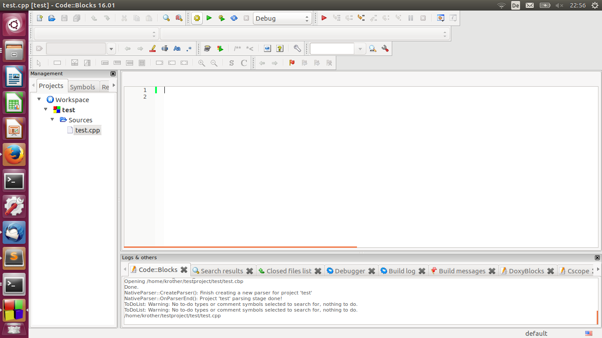
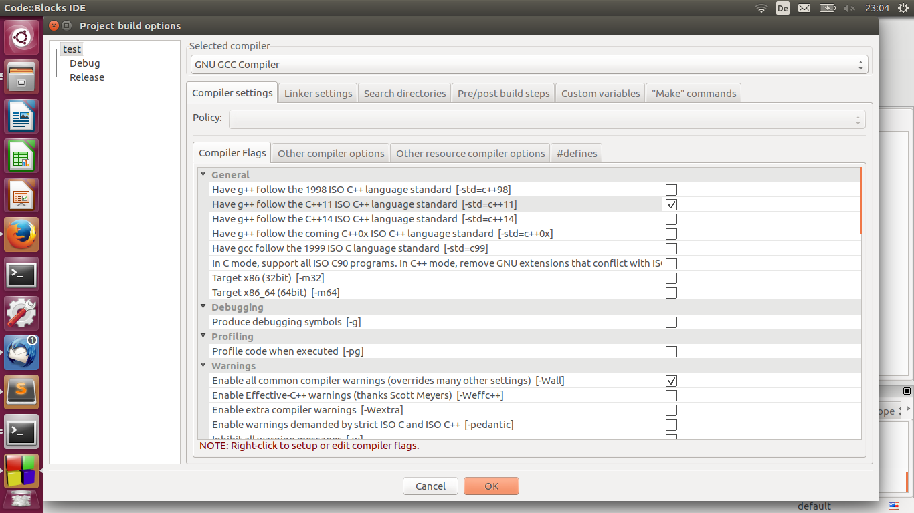

# Ein Projekt in Code::Blocks anlegen

## Schritt 1: Neues Projekt erstellen

1. Wähle im Menü oben *'File -> New -> Project'*
2. Wähle im Dialogfenster *'Empty project'* (auch für SDL-Projekte!)
3. Gib einen Namen und ein Projektverzeichnis an
4. Klicke dich durch den Dialog.

Nun sollte das Projekt in der Liste links erschienen sein:

Im Projektverzeichnis findest Du eine Datei `projektname.cbp`. Diese enthält die Projekteinstellungen. Es ist **keine** C++-Datei.

## Schritt 2: Eine C++-Datei anlegen

1. Wähle im Menü oben *'File -> New -> Empty file'*
2. Wähle einen Namen **mit der Endung `.cpp`** aus

Die ausgewählte Datei sollte in der Projektübersicht links erscheinen:

### Optional: Ein existierendes C++-Programm importieren

1. Prüfe, ob links die Karte *'Projects'* ausgewählt ist (ganz ganz links)
2. Rechtsklick auf den Namen des Projekts und *'Add files'* auswählen
3. Wähle die zu importierende `.cpp`-Datei aus.
4. Klicke dich durch den Dialog.

## Schritt 3: Code schreiben

Fülle die Datei mit Code.

## Schritt 4: Compilereinstellungen

1. Rechtsklick auf das Projekt in der Projektleiste
2. Wähle *'Properties'*
3. Wähle *'Projects Build Options'* (rechts unten)
4. Setze das Häkchen *'follow the C++11 ISO standard'*

