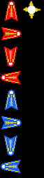
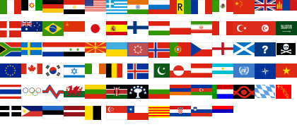

# Die Grafik im Spiel

### Aufgabe

Sammelt Bilder, die im Projekt nützlich sein könnten.
Sichte dazu das Bildmaterial weiter unten. Ergänze es gegebenenfalls durch Grafiken aus dem Internet oder selbst erstellte Grafik.

Macht Euch über folgende Punkte Gedanken:

* Soll das Spiel überhaupt Grafik enthalten?
* Welche Art von Grafik soll es geben (Standbilder, Kachelgrafik, 3D)?
* Bei Kachelgrafik: Wie groß soll die einzelne Kachel sein?
* Sollen sich Bildelemente vergrößern/verkleinern (benötigt Textures)?
* Soll es Animationen geben?
* Dürft Ihr alle eingeplanten Grafiken verwenden, ohne Urheberrechte zu verletzen?

### Frei verfügbare Grafikelemente

Aus dem Spiel **Bub 'n Bros**:

### Spieszenen, die Kristian programmiert hat

*frei verfügbare Grafiken*

