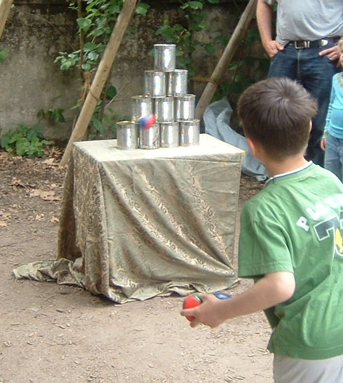
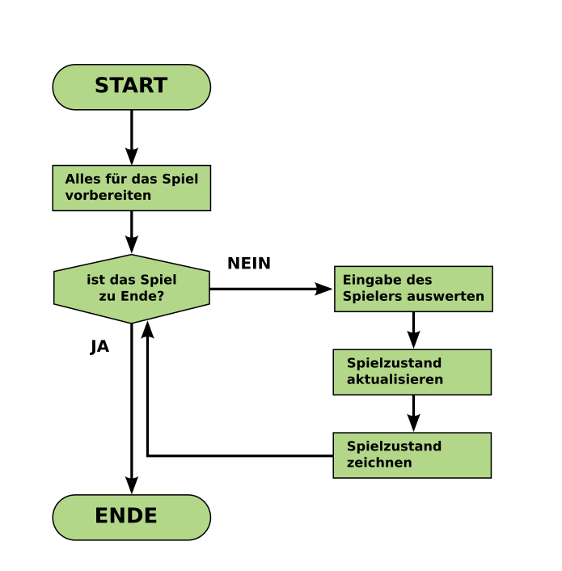

# Schleifen

## Wozu benötigen wir Schleifen?

*von Peng, 2008, Eigenes Werk, CC BY-SA 3.0. Wikimedia Commons*

Stelle Dir eine Runde Dosenwerfen vor. Du wirst einen Ball und einige Dosen fallen um (oder auch nicht). Danach wirfst Du den nächsten Ball, bis alle Dosen abgeräumt oder die Bälle alle sind. Für uns als Programmierer sind dabei zwei Dinge interessant:

1. Das Werfen des Balles wiederholt sich
2. Wir wissen nicht im Voraus, wie viele Bälle geworfen werden.

Allgemeiner können wir für das Dosenwerfen ein **Flußdiagramm** formulieren, das für sehr viele Spiele gültig ist:

Um die Schleife im Flußdiagramm in C++ zu programmieren, benötigen wir die **Schleifenbefehle**.
Es gibt drei Arten von Schleifen in C++:

## Bedingte Schleifen mit `do..while`

Die `do..while` Schleife wiederholt Anweisungen, solange die Bedingung am Ende wahr ist. Die Schleife wird mindestens ein Mal ausgeführt.

    int a = 10;
    do {
        cout << "Countdown ist bei: " << a << endl;
        a = a - 1;
    } while (a > 0);

Es ist wichtig, daß die Variable in der Bedingung (`a`) *außerhalb* der Schleife definiert wird.

## Bedingte Schleifen mit `while`

Es geht auch umgekehrt. Bei einer `while`-Schleife steht die Bedingung am Anfang. Daher kann es sein, daß eine `while`-Schleife kein Mal ausgeführt wird.

Ein Beispiel:

    int a = 10;
    while (a > 0) {
        cout << "Countdown ist bei: " << a << endl;
        a = a - 1;
    }

### Achtung, Endlosschleifen!

Mit `do..while` und `while` ist es möglich, Endlosschleifen zu bauen. Ein häufiger Fehler ist, die Variable für die Abbruchbedingung zu vergessen. Folgendes Programm läuft ewig weiter:

    int a = 10;
    while (a > 0) {
        cout << "Countdown ist bei: " << a << endl;
    }

## `for`-Schleifen

Schleifen mit `for` haben statt einer Bedingung eine *Zählervariable*. Mit `for`-Schleifen kannst Du Anweisungen eine bestimmte Anzahl von Malen wiederholen.

Auch hierzu ein Beispiel:

    for (int i=0; i < 10; i++) {
        cout << "Zahl: " << i << endl;
    }

Der Ausdruck in der runden Klammer beim `for` bedeutet folgendes:

1. Zu Beginn der Schleife setze die Zählervariable `i` auf 0.
2. Die Schleife soll so lange laufen, wie `i` kleiner als 10 ist.
3. Nach jedem Schleifendurchlauf, erhöhe `i` um 1. (Der Operator `++` tut das gleiche wie `i=i+1`)
