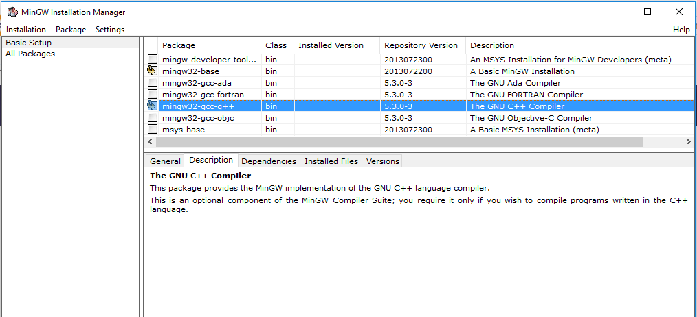
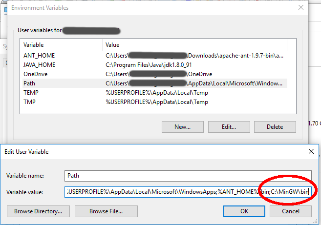
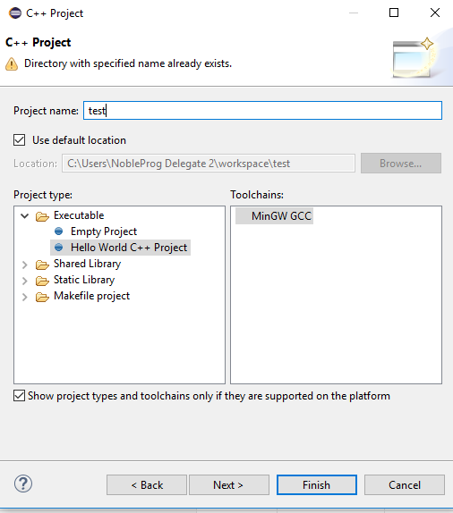

# Installation von C++ unter Windows

## Schritt 1: MinGW installieren

Zuerst installieren wir den C++-Compiler **MinGW**.

1. Lade die Installationsdatei für MinGW für Windows von [www.mingw.org/category/wiki/download](http://www.mingw.org/category/wiki/download) herunter
2. Starte die Installationsdatei
3. Wähle in der Paketauswahl die Pakete **base** und **gcc** an.
4. Wähle im Menü `Apply Changes` aus, um die Pakete zu installieren.

#### Überprüfung

Öffne eine Windows-Konsole (führe das Programm `cmd` aus). Wechsle in das MinGW Verzeichnis mit

    cd C:\MinGW\bin

Führe das Programm `g++` aus. Wenn Du die folgende Fehlermeldung siehst, hat alles funktioniert.

    g++: fatal error: no input files
    compilation terminated.

**Gratuliere!** Damit hast Du theoretisch alles was Du benötigst. Allerdings werden wir noch ein paar weitere Programme installieren, um uns die Arbeit bequemer zu machen.

## Schritt 2: Pfad auf MinGW setzen

Damit wir den Compiler `g++` von überall her starten können, müssen wir die sogenannte **Pfadvariable** setzen. Windows sucht nach zu startenden Programmen in den im Pfad angegebenen Verzeichnissen.

1. Öffne die *Systemsteuerung*
2. Öffne dort die Kategorie *System*
3. Wähle dort den Abschnitt *Erweiterte Systemeinstellungen* oder *Erweitert*
4. Drücke den Knopf *Umgebungsvariablen*
5. Erstelle eine neue Umgebungsvariable *PATH* mit dem Wert *`C:\MinGW\bin`* . Falls *PATH* bereits definiert ist, kannst Du über **ein Semikolon** weitere Verzeichnisse anhängen, also `was_schon_da_war;C:\MinGW/bin`
6. Schliesse den Dialog und die Systemsteuerung wieder. **Erst dann werden die Änderungen wirksam**.

#### Überprüfung

Öffne eine Windows-Konsole (führe das Programm `cmd` aus). Tippe ohne das Verzeichnis zu wechseln `g++` ein. Wenn die gleiche Fehlermeldung (*`fatal error`*) wie oben erscheint, hat es funktioniert. 

## Schritt 3: Eclipse installieren

**Eclipse** ist eine komfortablere Entwicklungsumgebung zum Schreiben von C++-Programmen. Allerdings ist die Einarbeitung auch deutlich länger als mit einem Texteditor. Eclipse ist in der Programmiersprache **Java** geschrieben, die wir ebenfalls installieren müssen.

1. Lade das **JDK** (nicht JRE!) von [www.java.com](http://www.java.com) herunter. Zuletzt überprüft wurde das [Java SE Development Kit 8u131](http://www.oracle.com/technetwork/java/javase/downloads/index-jsp-138363.html#javasejdk)
]
2. Lade **Eclipse Neon** von [www.eclipse.org/downloads/](http://www.eclipse.org/downloads/) herunter
3. Installiere das JDK.
4. Installiere Eclipse. Wähle im Installationsprogramm die Option **Eclipse für C++** aus.

#### Überprüfung

Erstelle in Eclipse ein neues C++-Projekt. 

Wähle als Typ MinGW und **"C++ Hello World Project"**. Gib dem Projekt einen Namen. Kompiliere das Programm mit dem Knopf **build** und führe es aus. Wenn du eine Nachricht im Ausgabefenster siehst, hat alles funktioniert. 

#### Erste Hilfe

Eventuell mußt Du die Eclipse-Oberfläche von Java auf C++ umstellen. Das kannst Du im Menü `Window -> Perspective -> C++`.

Falls die Option *"Eclipse für C++"* bei Schritt 4 nicht erscheint, suche im Internet nach **Eclipse CDT**.

