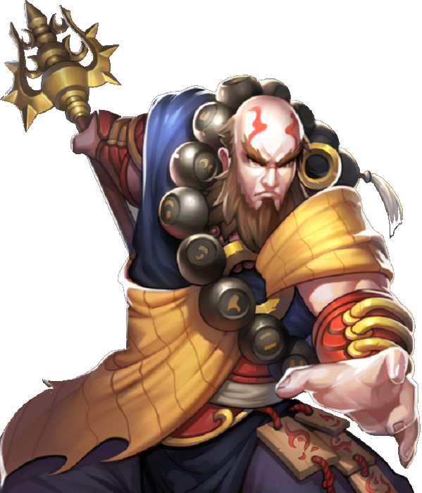

# Der Magier und die Kiste

Irgendwo in der Landschaft liegt eine geheimnisvolle Schatztruhe. 

Darin liegt eine Schriftrolle.

Diese braucht der Magier, der einem verraten kann, wo das Ei liegt.

### Anforderungen

* Der Spieler kann eine *Benutzen*-Taste drücken (Leertaste, Enter).
* Die Kiste kann durch einmaliges Benutzen geöffnet werden.
* Die Kiste enthält die Schriftrolle.
* Der Magier verschwindet, wenn man ihm die Schriftrolle gibt.
* Nach jeder erfolgreichen Aktion ändert sich die Grafik.
* Erst wenn der Magier zufrieden ist, kann man das Spiel beim Drachenei beenden.

### Materialien

* mehr Bilder

### Hinweise:

* Die Bilder mit dem Magier und der Kiste sind teilweise transparent. Du kannst mehrere Bilder aufeinander zeichnen.
* Verwende `bool`-Variablen, um den Zustand des Spiels festzuhalten.
* Es ist nichts Schlimmes dabei, wenn hierbei eine ganze Reihe `if`-Abfragen entstehen. Genau das üben wir hier.
