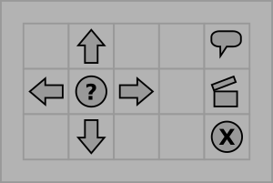

# Schnelle Steuerung

Bisher mußten wir jede Eingabe mit `<ENTER>` bestätigen. Die Grafik ist bisher in einem eigenen Fenster, das keine Eingabe zuläßt – es ist also nebenher ein Textfenster offen.

Das muß unbedingt verbessert werden. Dazu benötigen wir **Events**.

## Anforderungen

* Der Spieler/Die Spielerin kann die Räume mit einem einzelnen Tastendruck wechseln.

## Infomaterialien

* Events in SDL
* Beispielprogramm `sdl_events.cpp` 

## Schritt für Schritt

In diesem Teil werden wir alle Aufrufe von `cin` herauswerfen. Stattdessen werden wir SDL-Events für die Tastatureingabe verwenden. Die Hauptschwierigkeit besteht darin, dass die Events eine zusätzliche `while`-Schleife benötigen.

### Schritt 1: Ein bestehendes Programm umbauen

Verwende das fertige Projekt aus der zweiten Aufgabe **"Landschaftsbilder"**. Stelle sicher, dass das Programm funktioniert.

### Schritt 2: Events abfragen

Finde die Zeile im Programm, an der Du von der Tastatur einliest, also etwas wie

    cin >> eingabe;

An diese Stelle werden wir uns um Events kümmern. Hole zuerst sämtliche Events ab. Schreibe dazu **vor** der Zeile mit `cin`:

    SDL_Event e;
    while( SDL_PollEvent( &e ) != 0 ) { 

    }

Da diese Schleife leer ist, tut sie noch nichts. Es wird einfach nur die Event-Queue geleert.

**Compiliere das Programm und stelle sicher, dass es läuft. Du solltest beobachten, dass das Fenster nicht mehr grau wird (falls es das vorher tat).**

### Schritt 3: Tastaturereignisse

In der `while`-Schleife wird das jeweils aktuelle Event in der Variable `e` gespeichert. Manche der Events sind Tastendrucke, andere nicht (z.B. Mausbewegungen, auch leere Events sind dabei).

In diesem Schritt geben wir einfach nur die gedrückten Tasten aus. Dazu möchten wir *nur* die Tastatur-Events erkennen. Die Taste steht als Zahl in `e.key.keysym.sym`. Erweitere die zuvor leere `while`-Schleife:

    while( SDL_PollEvent( &e ) != 0 ) { 
        if( e.type == SDL_KEYDOWN ) {
        	cout << "Taste gedrückt" << e.key.keysym.sym << endl;
        }
    }

**Compiliere das Programm und stelle sicher, dass es läuft. Du solltest bei jedem Tastendruck eine Zahl in der Ausgabe sehen.**

### Schritt 4: Tasten erkennen

Nun kannst Du auf bestimmte Tasten reagieren, so ähnlich wie es mit dem Ergebnis von `cin` kannst. Weil die Tastencodes Integers sind, müssten wir eigentlich schreiben:

    if (e.key.keysym.sym == 65) { ... }     // Aktion 1
    if (e.key.keysym.sym == 66) { ... }     // Aktion 2
    if (e.key.keysym.sym == 67) { ... }     // Aktion 3

So ist es natürlich schwer zu erkennen, welche Zahl zu welcher Taste gehört. Glücklicherweise bietet SDL zu diesem Zweck vorbereitete **Konstanten** an. Du kannst also schreiben:

    if (taste == SDLK_w) {
    	cout << "Du gehst nach Westen" << endl;
    	position++;
    }

Du findest alle Konstanten für Tasten in einer [riesigen Tabellle](https://wiki.libsdl.org/SDLKeycodeLookup).

Passe die Steuerung für 2 Tasten an.

**Compiliere das Programm und stelle sicher, dass es läuft. Die Steuerung funktioniert vermutlich noch nicht einwandfrei.**

### Schritt 5: Aufräumen

Nun brauchts Du den alten Code mit `cin` nicht mehr. Dazu kannst Du alles, was nach `cin` für eine bestimmte Taste passiert, in den entsprechenden `if`-Block des Events verschieben.

Anschließend kannst Du das `cin` und alle `if`-Anweisungen, die sich daruf beziehen, löschen.

Pass auf, dass Du das Darstellen der Bilder und den Aufruf von `SDL_UpdateWindowSurface` **nicht** löscht.

**Compiliere das Programm und stelle sicher, dass es läuft.**

## Für Fortgeschrittene

### Quit-Event

Lasse das Programm auf Events from Typ `SDL_QUIT` reagieren, so dass Du das Programm über das *Schließen*-Kontrollfeld beenden kannst.

### Maussteuerung

Setze die Steuerung mit Hilfe von Mausklicks um. Du kannst für die Steuerungsleiste dieses Bild verwenden:

