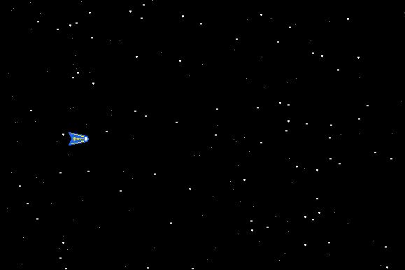

# Projekt 3: Raumschiffrennen

In diesem Projekt gib es Action! Wir fliegen mit unserem Raumschiff mit Vollgas durch den Weltraum. Von rechts kommen Scharen unbekannter Flugobjekte angeflogen: Meteoriten, Außerirdische und wertvolle Materialien. Es gilt, die Boni einzusammeln, ohne mit den restlichen Objekten zu kollidieren.

## Etappenziele

| Nr. | Name           | Thema  | Farbe |
|-----|----------------|--------|-------|
| 3.1 | Sternenhimmel | Grafik positionieren | gelb |
| 3.2 | Das Raumschiff | Klassen  | orange |
| 3.3 | Boni und Gegner | Vererbung | grün |
| 3.4 | Bewegungspfade | Komposition  | grün |
| 3.5 | Geschwader | Vektoren | blau |

