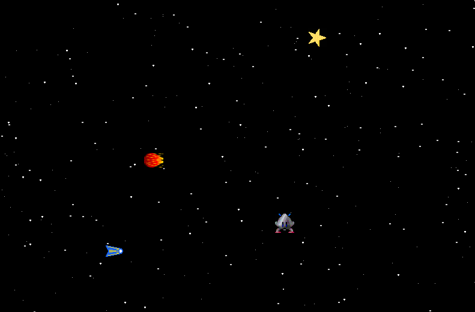

# Boni und Gegner

### Ziel

Du bist nicht allein! Im Weltraum gibt es noch mehr Flugobjekte. Manche davon sind freundlich, anderen sollte man aus dem Weg gehen.

### Anforderungen

* Im Weltraum sind noch zwei weitere Objekte unterwegs: ein Meteorit und ein Bonus (Stern).
* Mindestens eines der beiden Objekte bewegt sich.
* Wenn das Raumschiff mit dem Stern kollidiert, wird dieser eingesammelt.
* Wenn das Raumschiff mit dem Meteoriten kollidiert, ist das Spiel zu Ende.

### Materialien

* Vererbung
* Beispielprogramm `tiere.cpp`
* Kollisionsabfrage mit SDL
