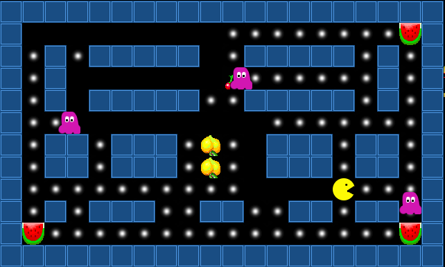

# Projekt 4: Punktefresser

Im letzten Projekt wenden wir uns Spielen mit Kachelgrafik zu. Dazu schreiben wir ein Spiel, bei dem eine Figur Punkte und andere Dinge in einem Labyrinth frisst.

In diesem Projekt können wir alles bisher erlernte zusammenbringen.

## Etappenziele

| Nr. | Name           | Thema  | Farbe |
|-----|----------------|--------|-------|
| 4.1 | Features planen | User Stories | gelb |
| 4.2 | Das Spielfeld zeichnen | 2D-Arrays | orange |
| 4.3 | Ein Datenmodell entwickeln | UML | grün |
| 4.4 | Professionelle Entwicklungswerkzeuge | Klassen | grün |
| 4.5 | Programmstruktur | Header-Dateien | blau |
| 4.6 | Das Programm ausliefern | Laden/Speichern  | schwarz |
